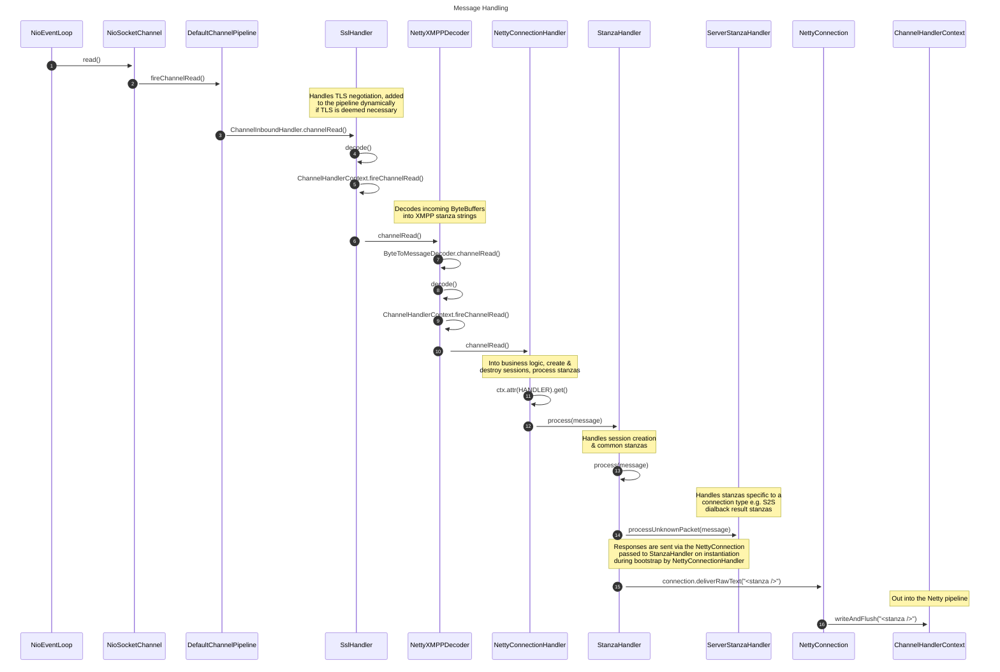

# Openfire Message Handling with Netty

The following diagram shows how network messages (e.g. TLS, XMPP stanzas) are processed by the Netty-based networking layer in Openfire.

```mermaid

sequenceDiagram title Message Handling
    autonumber
    NioEventLoop->>+NioSocketChannel: read()
    NioSocketChannel->>+DefaultChannelPipeline: fireChannelRead()
    Note over SslHandler: Handles TLS negotiation, added<br/> to the pipeline dynamically <br/> if TLS is deemed necessary
    DefaultChannelPipeline->>+SslHandler: ChannelInboundHandler.channelRead()
    SslHandler->>+SslHandler: decode()
    SslHandler->>+SslHandler: ChannelHandlerContext.fireChannelRead()
    Note over NettyXMPPDecoder: Decodes incoming ByteBuffers <br/>into XMPP stanza strings
    SslHandler->>+NettyXMPPDecoder: channelRead()
    NettyXMPPDecoder->>+NettyXMPPDecoder: ByteToMessageDecoder.channelRead()
    NettyXMPPDecoder->>+NettyXMPPDecoder: decode()
    NettyXMPPDecoder->>+NettyXMPPDecoder: ChannelHandlerContext.fireChannelRead()
    NettyXMPPDecoder->>+NettyConnectionHandler: channelRead()
    Note over NettyConnectionHandler: Into business logic, create & <br/> destroy sessions, process stanzas
    NettyConnectionHandler->>+NettyConnectionHandler: ctx.attr(HANDLER).get()
    NettyConnectionHandler->>+StanzaHandler: process(message)
    Note over StanzaHandler: Handles session creation <br /> & common stanzas
    StanzaHandler->>+StanzaHandler: process(message)
    Note over ServerStanzaHandler: Handles stanzas specific to a <br /> connection type e.g. S2S <br />dialback result stanzas
    StanzaHandler->>+ServerStanzaHandler: processUnknownPacket(message)
    Note over ServerStanzaHandler, StanzaHandler: Responses are sent via the NettyConnection <br /> passed to StanzaHandler on instantiation <br />during bootstrap by NettyConnectionHandler
    StanzaHandler->>+NettyConnection: connection.deliverRawText("<stanza />")
    Note over ChannelHandlerContext: Out into the Netty pipeline
    NettyConnection->>+ChannelHandlerContext: writeAndFlush("<stanza />")

```
