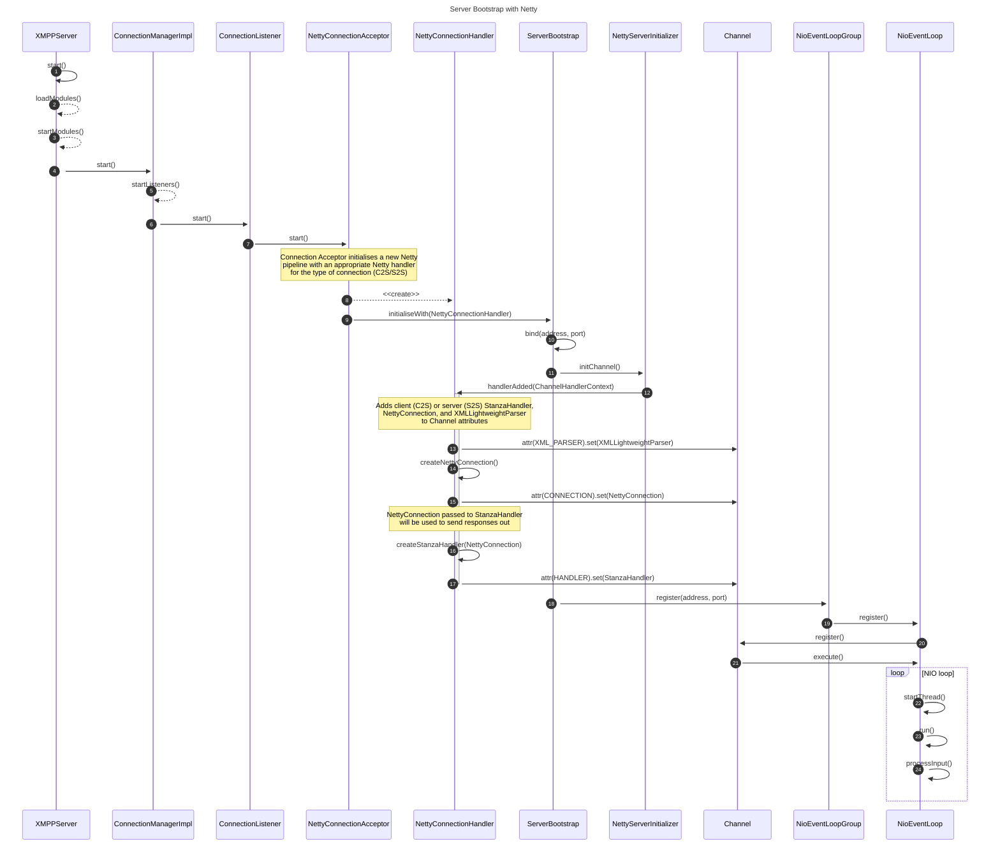

# Openfire Server Bootstrap with Netty

The following diagram shows how, on start of the XMPPServer, a Netty server is initialised and bound to a port. 

```mermaid

sequenceDiagram title Server Bootstrap with Netty
autonumber
    XMPPServer->>+XMPPServer: start()
    XMPPServer-->>+XMPPServer: loadModules()
    XMPPServer-->>+XMPPServer: startModules()
    XMPPServer->>+ConnectionManagerImpl: start()
    ConnectionManagerImpl-->>+ConnectionManagerImpl: startListeners()
    ConnectionManagerImpl->>+ConnectionListener: start()
    ConnectionListener->>+NettyConnectionAcceptor: start()
    Note over NettyConnectionAcceptor: Connection Acceptor initialises a new Netty<br/> pipeline with an appropriate Netty handler<br/>for the type of connection (C2S/S2S)
    NettyConnectionAcceptor-->>+NettyConnectionHandler: <<create>>
    NettyConnectionAcceptor->>+ServerBootstrap: initialiseWith(NettyConnectionHandler) 
    ServerBootstrap->>+ServerBootstrap: bind(address, port) 
    ServerBootstrap->>+NettyServerInitializer: initChannel()
    NettyServerInitializer->>+NettyConnectionHandler: handlerAdded(ChannelHandlerContext)
    Note over NettyConnectionHandler: Adds client (C2S) or server (S2S) StanzaHandler,<br/> NettyConnection, and XMLLightweightParser<br/> to Channel attributes
    NettyConnectionHandler->>Channel: attr(XML_PARSER).set(XMLLightweightParser)
    NettyConnectionHandler->>NettyConnectionHandler: createNettyConnection()
    NettyConnectionHandler->>Channel: attr(CONNECTION).set(NettyConnection)
    Note over NettyConnectionHandler: NettyConnection passed to StanzaHandler <br/>will be used to send responses out
    NettyConnectionHandler->>NettyConnectionHandler: createStanzaHandler(NettyConnection)
    NettyConnectionHandler->>-Channel: attr(HANDLER).set(StanzaHandler)
    ServerBootstrap->>+NioEventLoopGroup: register(address, port) 
    NioEventLoopGroup->>+NioEventLoop: register() 
    NioEventLoop->>+Channel: register() 
    Channel->>+NioEventLoop: execute() 
loop NIO loop
    NioEventLoop->>+NioEventLoop: startThread()
    NioEventLoop->>+NioEventLoop: run()
    NioEventLoop->>+NioEventLoop: processInput() 
end

```
