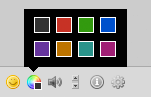

# Colors
Send and receive colored messages.

This plugin uses an own format of messages (`foobar` becomes e.g. `|c:1|foobar`).
If you'd like to use XHTML for formatting messages (this ensures third-party clients could also
display it properly), please use [colors-html](https://github.com/candy-chat/candy-plugins/tree/master/colors-xhtml).



## Usage
To enable *Colors* you have to include its JavaScript code and stylesheet

```HTML
<script type="text/javascript" src="candyshop/colors/candy.js"></script>
<link rel="stylesheet" type="text/css" href="candyshop/colors/candy.css" />
```

Call its `init()` method after Candy has been initialized:

```JavaScript
Candy.init('/http-bind/');

// enable Colors plugin (default: 8 colors)
CandyShop.Colors.init();

Candy.Core.connect();
```

To enable less or more colors just call `CandyShop.Colors.init(<number-of-colors>)`.
