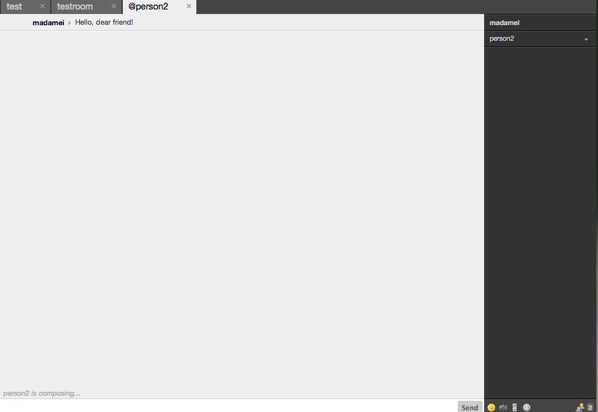

# Typing Notifications

A plugin for Candy Chat to enable typing notifications to show up. Fully compatible with the lefttabs plugin.

## Todo

It would be nice to extend this to groupchat as well. Currenly only working for private chat. (Simpler.)




## Usage
Include the JavaScript and CSS files:
```HTML
<script type="text/javascript" src="candyshop/typingnotifications/typingnotifications.js"></script>
<link rel="stylesheet" type="text/css" href="candyshop/typingnotifications/typingnotifications.css" />
```

To enable this typing notifications plugin, add its `init` method after you `init` Candy, but before `Candy.connect()`:
```JavaScript
CandyShop.TypingNotifications.init();
```
